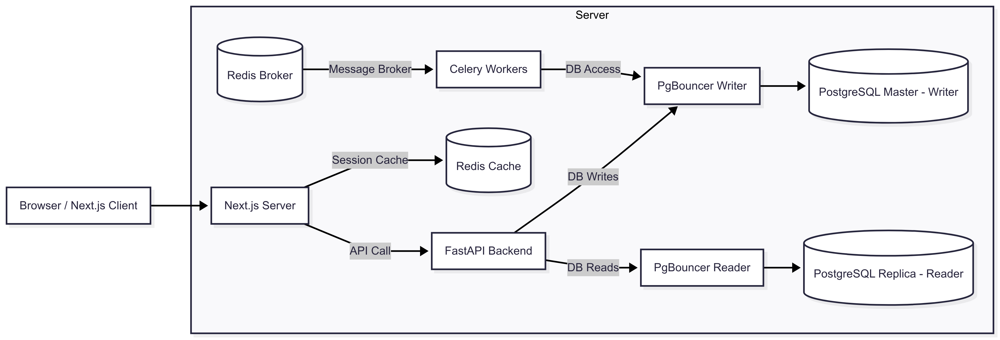

# Authflow — Modern, Scalable Authentication System 🚀

Authflow is a **production-ready**, robust authentication system designed for **speed**, **scalability**, and an excellent **developer experience**. It combines modern technologies — **Next.js**, **FastAPI**, **async SQLAlchemy**, **Celery**, and **Redis shared caching** — within a fully dockerized environment built to scale effortlessly from local development to cloud production.

## Key Features

- **Highly efficient:** Minimal API requests powered by smart token caching, **Redis shared user cache**, and shared user context enable fast, seamless authentication flows.  
- **Enterprise-inspired architecture:** Primary-replica PostgreSQL setup with PgBouncer connection pooling, reflecting real-world cloud-native environments like EKS and Aurora.  
- **Developer-friendly:** Automatic generation of shared types from backend OpenAPI specs to frontend TypeScript ensures strong, end-to-end type safety across the stack.  
- **Robust tooling:** Alembic migrations, Storybook visual tests, and scheduled background jobs (e.g., token cleanup) maintain system reliability and smooth operation.  
- **Flexible & future-proof:** Modular design combined with container orchestration, async task queues (Celery), and Redis caching built to scale seamlessly.

Authflow is more than just authentication — it’s a solid foundation for building secure, performant applications with confidence.

---

## Getting Started

### Prerequisites

- Docker and Docker Compose installed  
- Ports 5432, 5433, 6379, 6432, 6433, 8000, 3000, and 6006 available on your machine  

### Run Locally

```bash
docker compose build
docker compose up
```

## Auth Flow (High-Level)



The login and authentication lifecycle between the browser, Next.js, and FastAPI is designed for full SSR compatibility and secure cookie handling:

```text
[BROWSER]
   |
   | 1. User submits login form
   |
   V
[NEXT.JS SERVER] (API Route: /api/login)
   |
   | 2. Forwards credentials to FastAPI
   |
   V
[FASTAPI] (POST /users/login)
   |
   | 3. Returns tokens (access + refresh + expiry)
   |
   V
[NEXT.JS SERVER]
   |
   | 4. Sets httpOnly, secure cookies for tokens
   | 5. Stores or updates user session data in Redis cache
   |
   V
[BROWSER]
   |
   | 6. Stores cookies accessible by SSR
```

Social Login Flow

```
[BROWSER]
   |
   | 1. User clicks "Login with Social Provider" → opens OAuth popup
   |
   V
[SOCIAL PROVIDER OAUTH]
   |
   | 2. User authenticates → provider redirects popup to Next.js callback with code
   |
   V
[NEXT.JS API (/api/auth/social-callback)]
   |
   | 3. Exchanges code for tokens with provider
   | 4. Sends id_token (or equivalent) to FastAPI backend (/users/social-login)
   |
   V
[FASTAPI]
   |
   | 5. Verifies token, creates/gets user, returns app tokens
   |
   V
[NEXT.JS API]
   |
   | 6. Sets secure httpOnly cookies with tokens
   | 7. Redirects popup to /social-redirect
   |
   V
[BROWSER]
   |
   | 8. Closes popup, reloads main window to /profile with auth cookies set

```

Example fetch flow with auth and Redis shared cache:

```text
[BROWSER]
   |
   | 1. Requests page or API with access_token cookie
   |
   V
[NEXT.JS SERVER] (SSR or API Route)
   |
   | 2. Reads access_token from httpOnly cookies
   | 3. Checks Redis cache for user session data
   |    - If cache miss, fetches user data from FastAPI and updates Redis
   | 4. Forwards request with token to FastAPI
   |
   V
[FASTAPI] (GET /posts)
   |
   | 5. Validates token, returns data
   |
   V
[NEXT.JS SERVER]
   |
   | 6. Sends SSR-rendered HTML with data
   |
   V
[BROWSER]
   |
   | 7. Renders page
```

# Authflow: Scalable, Production-Grade Auth System

## Architecture Overview

| Layer        | Stack                                         |
|--------------|-----------------------------------------------|
| Frontend    | Next.js (App Router) – SSR, API Routes, Middleware, Storybook |
| Backend     | FastAPI – Async IO, OAuth2, REST APIs, OpenAPI schema |
| Auth        | Cookie-based (httpOnly) access/refresh tokens + rotation middleware |
| Worker      | Celery + Redis – async background task queue  |
| Database    | PostgreSQL 15 (Bitnami) – Writer + Read Replica with replication |
| Pooling     | PgBouncer – separate write/read poolers       |
| Cache       | Redis – token/session caching + Celery broker |
| Container   | Docker Compose (local), designed for EKS migration |

## Architecture Patterns

| Pattern                     | Purpose                                  |
|-----------------------------|------------------------------------------|
| Split Reader/Writer DB      | Offloads reads to replicas for scalability |
| PgBouncer Transaction Pooling | Reduces DB connection overhead          |
| Celery Workers             | Offloads async tasks (email, cleanup, etc.) |
| Token Rotation Middleware  | Automatic token refresh in Next.js middleware |
| Stateless Services         | Supports autoscaling without sticky sessions |
| Env-based Configs          | Simplifies switching environments        |

## Local Dev Replica vs Production

| Service         | Local Substitute             | Production Equivalent         |
|-----------------|-----------------------------|------------------------------|
| PostgreSQL      | Bitnami master + replica    | Aurora Cluster                |
| PgBouncer       | Dockerized separate configs | Same                         |
| FastAPI backend | Uvicorn with reload          | Gunicorn/UVLoop              |
| Celery + Redis  | Single worker + Redis        | Multiple workers + Redis Cluster |
| Next.js Frontend| Dev server                  | Self-hosted        |
| Redis           | Single container             | Clustered Redis              |
| Container Orchestration | Docker Compose           | kubectl on EKS/ECS    |


## Kubernetes Pod Grouping & Deployment Strategy (Production)

| Pod Group                   | Services Included           | Rationale / Notes                                                 | **Prod Pod Size**             |
| --------------------------- | --------------------------- | ----------------------------------------------------------------- | ----------------------------- |
| **frontend**                | Next.js app                 | Handles SSR, API routes, horizontally scalable                    | 500m–1 CPU / 512Mi–1Gi RAM    |
| **backend**                 | FastAPI app                 | Core API service, scales for API RPS and latency                  | 1–2 CPU / 1–2Gi RAM           |
| **pgbouncer\_writer**       | PgBouncer for write DB      | Connects to Aurora writer endpoint; handles pooled writes         | 250–500m CPU / 256–512Mi RAM  |
| **pgbouncer\_reader**       | PgBouncer for read replicas | Pools Aurora read replicas; isolates and balances read query load | 250–500m CPU / 256–512Mi RAM  |
| **redis**                   | Redis for Celery broker     | Single pod as message broker and frontend cache                   | 500m–1 CPU / 1–2Gi RAM        |
| **celery\_worker**          | Celery async workers        | Stateless pods for background jobs, auto-scaled as needed         | 500m–1 CPU / 512Mi–1Gi RAM    |
| **celery\_beat**            | Celery scheduler            | Manages periodic tasks; lightweight, single pod                   | 250m–500m CPU / 256–512Mi RAM |
| **cms-frontend** (optional) | Next.js app (CMS UI)        | Separate frontend deployment for CMS, scales independently        | 500m–1 CPU / 512Mi–1Gi RAM    |


## Cost-Efficient Scaling Strategy (Production)

| **Aspect**                | **Why It Matters**                                           | **How We Handle It**                                                               |
| ------------------------- | ------------------------------------------------------------ | ---------------------------------------------------------------------------------- |
| **Small Pod Sizes**       | Avoid over-provisioning; only use what’s needed per request  | Use fine-grained CPU/memory per service (e.g., 500m–2 CPU), let K8s autoscale pods |
| **Horizontal Scaling**    | Safer failure isolation, better fault tolerance              | Add/remove pods dynamically based on CPU/RPS/queue depth                           |
| **Cluster Autoscaler**    | Scale infrastructure based on pod scheduling needs           | EKS Cluster Autoscaler adds/removes nodes as demand grows or shrinks               |
| **Idle Traffic Handling** | Most traffic is bursty or cyclical (e.g. nights/weekends)    | Idle pods scale down to zero or minimum replicas to cut costs                      |
| **Stateless Services**    | Enables elastic scaling; no sticky sessions or disk reliance | All services (API, workers, frontend) are stateless and restartable                |
| **Aurora Read Replicas**  | Read-heavy systems need DB scaling too                       | Aurora auto-scales read replicas behind a single reader endpoint                   |
| **Message Queues**        | Queue length varies — no need for constant worker presence   | Celery workers auto-scale based on queue depth and concurrency                     |
| **Pre-warmed Images**     | Slow pod startup wastes CPU during traffic spikes            | Use pre-pulled Docker images and warmed pods with readiness probes                 |


## Performance Considerations (Production)

| Metric           | Local (Dev)                  | Production Target                |
|------------------|------------------------------|--------------------------------|
| RPS (API)        | ~500–1k                      | 5k–10k sustained per instance  |
| Token Handling   | SSR cookie rotation per req  | FastAPI refresh + Redis caching |
| Task Queueing    | Single Celery worker          | Auto-scaled multiple workers    |
| DB Reads         | Single read replica           | Aurora with auto-scaling replicas |
| Pod Startup      | ~2–4 seconds Docker boot      | Pre-pulled images, warmed pods  |


## Autoscaling & Maximum Load (Production)

| **Load Level**          | **Description**                  | **Autoscaling Strategy**                                                                                         |
|------------------------|---------------------------------|-----------------------------------------------------------------------------------------------------------------|
| 🚀 **~7,000–8,000 RPS**  | Optimal RPS per FastAPI instance | Kubernetes autoscaler spins up new pods dynamically to maintain low latency                                      |
| ⚡ **~100,000 RPS**      | Medium-scale production traffic  | EKS scales FastAPI pods horizontally (~12–15 pods) with PgBouncer load balancing. Aurora uses read replicas to offload reads |
| 🔥 **~500,000 RPS**      | High-scale enterprise traffic    | Aggressive EKS scaling (~60+ pods); Aurora auto-replicas handle heavy read load; Redis clusters and Celery workers scale horizontally |


## Deployment Summary: Cost-Efficiency & Scale (Production)

| **Strategy**                 | **Approach**                                                                |
| ---------------------------- | --------------------------------------------------------------------------- |
| **Prefer small pods**        | Enables fine-grained autoscaling and reduces wasted compute                 |
| **Avoid vertical scaling**   | Instead of boosting pod size, spawn more pods and rely on EKS autoscaler    |
| **Stateless by default**     | Allows safe pod eviction, failover, and easier horizontal scaling           |
| **Minimal baseline pods**    | Services like `beat`, `pgbouncer`, and `redis` can run on 1 lightweight pod |
| **Scale queues elastically** | Celery workers scale based on task concurrency / backlog                    |
| **Aurora handles reads**     | Aurora auto-replicates, balancing load via read endpoints                   |
| **Pod grouping is logical**  | Separate concerns: frontend, backend, infra (db proxy, redis, celery, etc.) |

##  Staging Environment Philosophy & Best Practices

| **Aspect**               | **Description**                                                                                   |
|-------------------------|-------------------------------------------------------------------------------------------------|
| **Full Production Parity** | Staging mirrors production architecture, configs, and integrations to ensure reliable testing.    |
| **Scaled-Down Resources**  | Staging runs fewer pods and smaller node sizes but keeps all core services (DB, cache, workers). |
| **Isolated Data Stores**   | Separate Aurora cluster, S3 buckets, and Redis instances to avoid interference with production data. |
| **Separate Domains**       | Staging served on a dedicated domain or subdomain (`staging.example.com`) for clear separation.  |
| **Deployment Pipeline**    | Automated CI/CD deploys to staging on every merge or PR for immediate feedback and QA visibility.|
| **Safe Testing Ground**    | Bugs, data mutations, and experiments happen in staging, preserving production stability.       |
| **Access Control**         | Controlled access to staging environment to protect sensitive test data and avoid leaks.        |
| **Populating Data**        | Avoid syncing production data to staging — it leads to data corruption, privacy risks, and maintenance nightmares. Instead, use realistic dummy data tailored for safe testing. |


| **Git Branch** | **Trigger**        | **CI/CD Action**                         | **Environment**        | **Purpose**                                                     |
| -------------- | ------------------ | ---------------------------------------- | ---------------------- | --------------------------------------------------------------- |
| `staging`      | `git push staging` | Run tests → Build → Deploy to staging    | Staging environment    | Continuous integration & testing; preview for QA/devs/reviewers |
| `master`       | `git push master`  | Run tests → Build → Deploy to production | Production environment | Final release after staging approval; live app for users        |
